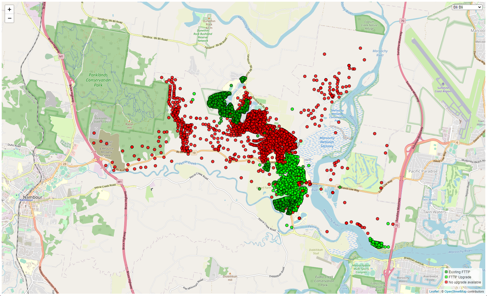
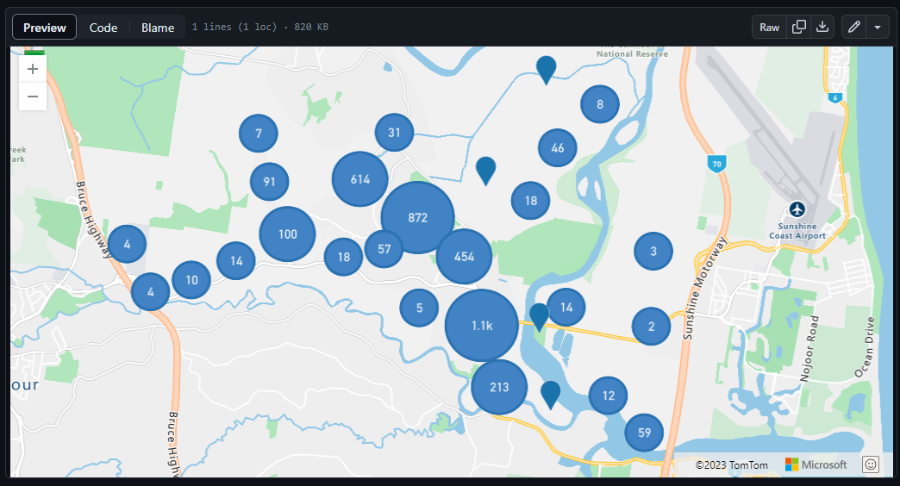

# NBN FTTP Upgrade Map

The Australian National Broadband Network (NBN) announced an on-demand upgrade program for select premises serviced via Fibre to the Node (FTTN) and Fibre to the Curb (FTTC) to Fibre to the Premises (FTTP) in October 2020.

NBN has progressively announced towns and suburbs where FTTN users will be eligable for a FTTP upgrade (FTTC areas aren't disclosed by NBN).

The details regarding actual availability of the program are limited with not all households in announced suburbs eligable for upgrades.

To address these concerns this project runs automated checks against the announced suburbs to generate interactive maps showing which premises are ready to upgrade.

## Tech Explanation

To know what premises reside within a given town/suburb the [Geocoded National Address File of Australia (GNAF)](https://data.gov.au/dataset/ds-dga-19432f89-dc3a-4ef3-b943-5326ef1dbecc/details) is used which contains 15.4 million Australian addresses. This dataset is provided over multiple files and requires significant processing before it can easily be used with a databse solution such as PostgreSQL, Hugh Saalmans has created [gnaf-loader](https://github.com/minus34/gnaf-loader) a Docker container which contains the GNAF dataset and administative boundaries in Postgress which is used. He has also created a slidedeck explaining the dataset which is available to view [here](https://minus34.com/opendata/georabble-intro-to-gnaf.pdf).

To check each address the NBN places APIs are used both to determine the LocID for a given address and then the premise details. These APIs are the same ones used on the main NBN Fast Fibre [website](https://www.nbnco.com.au/residential/upgrades/more-fibre). To speed up the process up to 20 simultaneous requests are made to these APIs by using the Python ThreadPool.

The results of these checks are stored in [GeoJSON](https://geojson.org/) files for each suburb containing the coordinates, street address, current NBN technology, NBN LocID, and NBN Fibre upgrade eligability. These files can be found in the results folder and can be viewed from within GitHub.

To improve the user experience a simple site is available for viewing this data, the website uses Leaflet to display the selected data with colour coded markers and info popups containing additional information for each premise.

The updating of data is performed with a GitHub Actions workflow that accepts a target suburb and will automatically fetch and publish all the data.

I hope to update this Action in future to operate entirely autonomously without the need for manual launching.

If you would like to see an additional suburb added please open an issue.